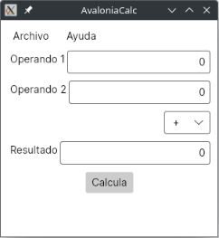
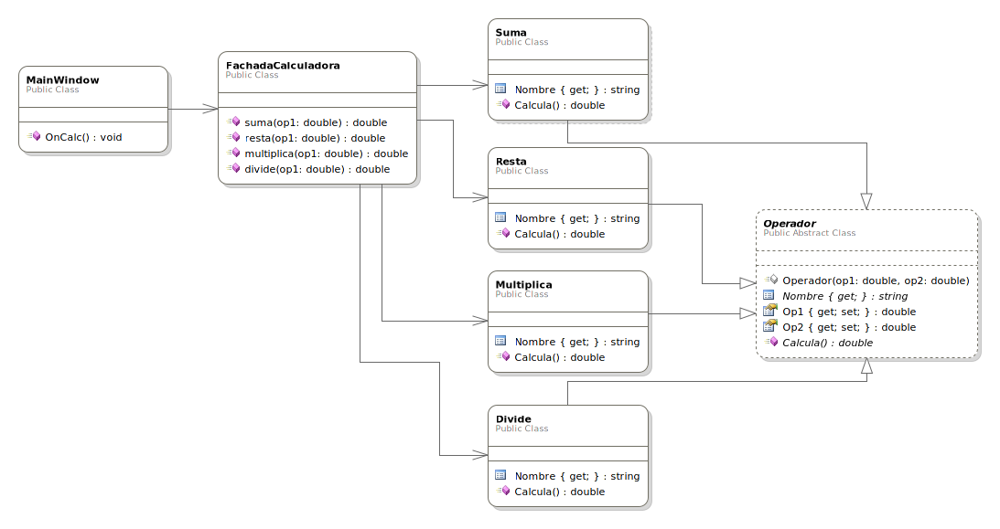

# AvaloniaCalc
## Intro



Una pequeña calculadora implementada con Avalonia como interfaz de usuario.

## Diseño

Se trata de un ejemplo exagerado a propósito para poder entender de forma completa el diseño con todos sus componentes, además de la interrelación entre ellos.



Se trata de un diseño básico que solo usa [MVC (separación de lógica de negocio y código de interfaz de usuario)](https://es.wikipedia.org/wiki/Modelo%E2%80%93vista%E2%80%93controlador), además del [patrón facade o fachada](https://es.wikipedia.org/wiki/Facade_%28patr%C3%B3n_de_dise%C3%B1o%29) para reducir las dependencias entre ambas partes. La aplicación de estos dos patrones es el mínimo diseño en que invertir ante cualquier proyecto.

## Construcción y ejecución

Este proyecto se ha construido con **IntelliJ Rider**, pero si no se desea usarlo, se puede construir y ejecutar desde línea de comando, asumiendo que [dotnet](http://dotnet.microsoft.com) está instalado:

```bash
$ dotnet build
$ dotnet run
```
En caso de obtener algún error debido al framework .NET empleado, será necesario cambiar el [archivo de proyecto](AvaloniaCalc/AvaloniaCalc.csproj), añadiendo una línea del estilo `<TargetFramework>net9.0</TargetFramework>` al primer `PropertyGroup` con el valor necesario.
